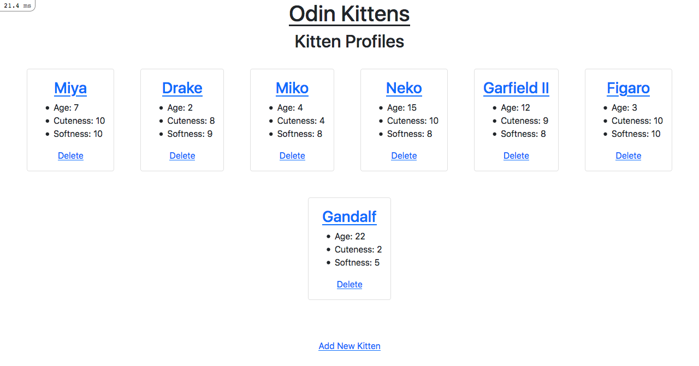

# Odin Kittens

>This project is a Rails app meant to be a *'data-producing API'*. It's my first attempt at building a Rails API app.

## About
This app should output json data and html. The project comes from the [Odin's Project **'Kittens API'**](https://www.theodinproject.com/paths/full-stack-ruby-on-rails/courses/ruby-on-rails/lessons/kittens-api).

### Live Demo

**Deployed on: Heroku**

[Odin Kittens](https://immense-plains-91632.herokuapp.com/) ⬅️⬅️ Click Here

### Features
- add, edit and delete kitten records
- get JSON responses

### Built with

- Ruby 3.0.0p0 (2020-12-25 revision 95aff21468) \[x86_64-darwin15\]
- Rails 6.1.3.2
- Sqlite3 '~> 1.4'
- Rest-client gem
- Mac OS
- VS Code

### App Screenshots
 

#### Homepage

#### New Kitten Page

## Deployment

### Requirements

- Ruby 3.0.0p0
- Rails 6.1.3.2
- Sqlite3 '~> 1.4'
- Linux/Mac Operating systems (preferred)

### Setup and Installation

#### Clone / Download Repo
1. Open your terminal or command prompt.
2. If you do not have git installed in your system, skip this step and go to step 3; otherwise, go to the directory where you want to copy the project files and clone it by copying this text into your command prompt/terminal: `git clone git@github.com:StarSheriff2/odin-kittens.git`.
 Now go to ***"Install Dependencies"*** section
3. Download the program files by clicking on the green button that says “**Code**“ on the upper right side of the project frame.
4. You will see a dropdown menu. Click on “**Download ZIP**“.
5. Go to the directory where you downloaded the **ZIP file** and open it. Extract its contents to any directory you want in your system.

#### Install Dependencies

1. If you are not in your system terminal/command prompt already, please open it and go to the directory where you cloned the remote repository or extracted the project files.
2. While in the project root directory, type `bundle install`. This command will install all the necessary gems in your system.
3. Then you can type <code>yarn install --check-files</code>.

#### Database Setup

1. Run `rails db:migrate`
2. Now run `rails db:seed`

## Usage
1. In your terminal, run <code>bin/rails server</code> while inside the root directory of the repository files
2. Go to your browser of choice and enter this URL: http://localhost:3000/
3. To get a JSON response from the browser, type any of the following in the URL bar:
    - `http://localhost:3000/kittens.json`
    - `http://localhost:3000/kittens/1.json`
4. To get the JSON response in your terminal, follow these steps:
    - Open your terminal and go the project's root directory
    - type `irb` in the terminal prompt to load the **Interactive Ruby Shell** enviroment
    - copy this into the IRB prompt: `require 'rest-client'`
    - now type something like this: `response = RestClient.get("http:localhost:3000/kittens", :accept => :json)`, and hit **return**
    - it should return something like: ***`=> <RestClient::Response 200 "[{\"id\":1,\"n...">`***
    - now render the response, by typing `response.body`
    - You should see a lot of output in JSON format!
    - Follow the same steps to render any kitten page in the same manner, by substituting `http:localhost:3000/kittens` with `http:localhost:3000/kittens/1` or any other number that corresponds to the id of a kitten record

## Author

👤 **Arturo Alvarez**
- Github: [@StarSheriff2](https://github.com/StarSheriff2)
- Twitter: [@ArturoAlvarezV](https://twitter.com/ArturoAlvarezV)
- Linkedin: [Arturo Alvarez](https://www.linkedin.com/in/arturoalvarezv/)

## 🤝 Contributing

Contributions, issues, and feature requests are welcome!

## Show your support

Give an ⭐️ if you like this project!

## 📝 License

This project is [MIT](https://github.com/StarSheriff2/odin-kittens/blob/development/LICENSE) licensed.
